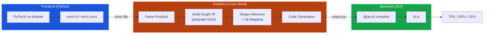
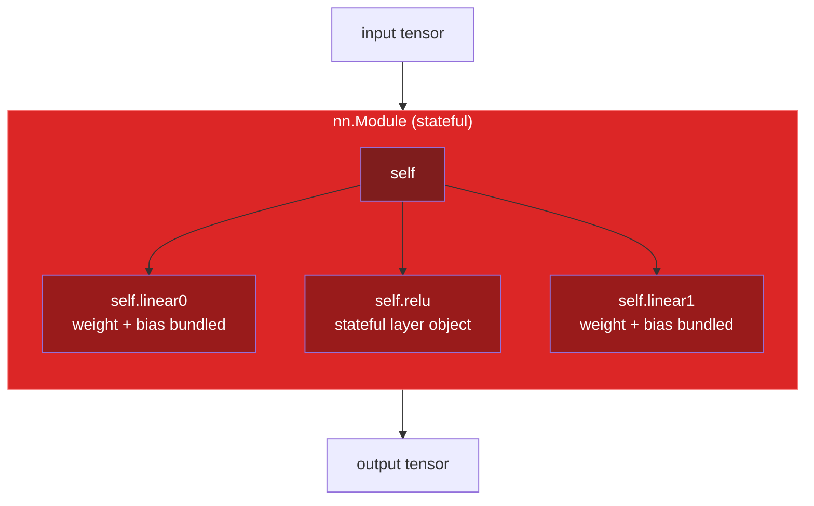
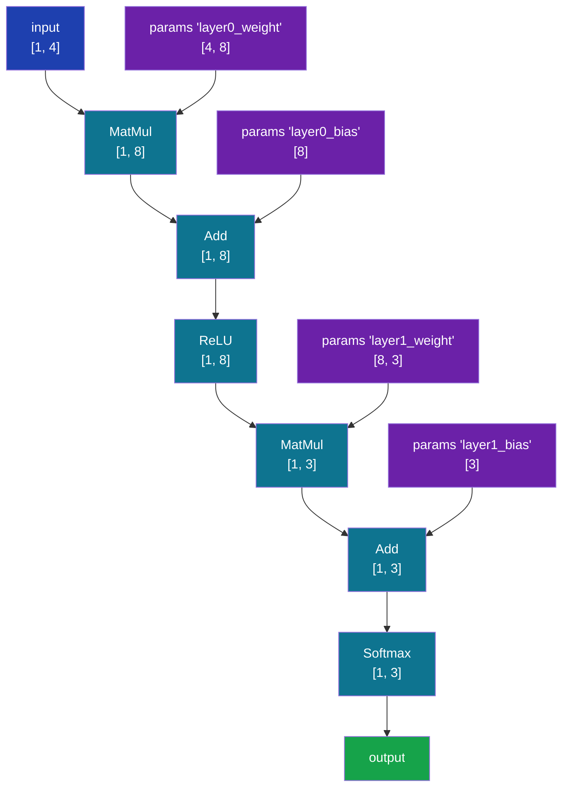
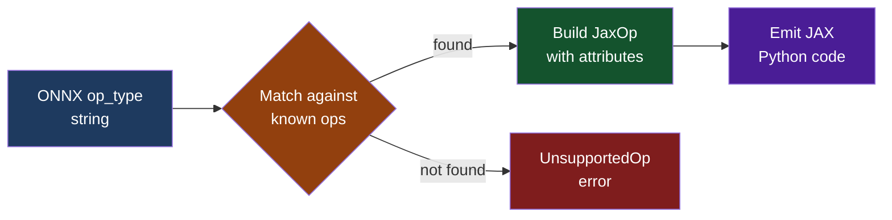
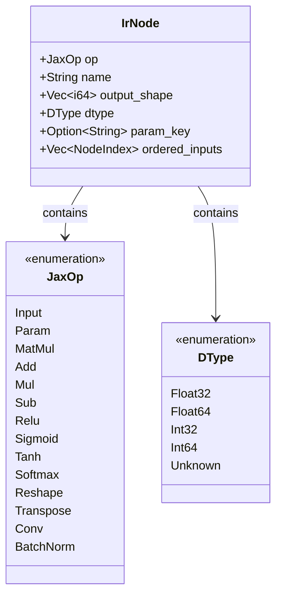
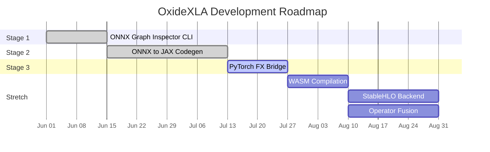
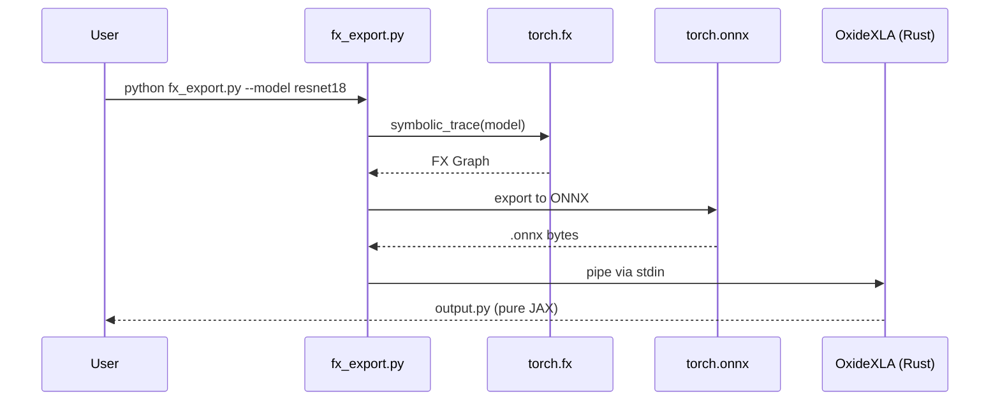

# OxideXLA

**A high-speed Rust compiler for transforming PyTorch FX graphs into pure, stateless JAX functions.**

---

## What It Does

OxideXLA reads ONNX computation graphs and emits runnable JAX Python code.
It is a graph-level transpiler, not a runtime wrapper. The output is a standalone
Python file that compiles under XLA with no framework dependencies beyond JAX itself.

```
PyTorch nn.Module --> torch.onnx.export --> .onnx file --> OxideXLA --> output.py --> jax.jit
```

## Why

- PyTorch dominates training. JAX dominates compilation and TPU deployment.
- Moving models between the two requires manual rewriting.
- OxideXLA automates that translation at the graph level.

### Why Not Just Load `.pth` in JAX?

A PyTorch `.pth` file is tightly coupled to Python's `pickle` serialization and PyTorch's internal object structure. JAX, built completely differently around XLA, cannot natively execute `.pth` files. 

OxideXLA bridges this gap by using ONNX as a universal intermediary:
1. **Extraction**: PyTorch weights and network structure are exported to ONNX.
2. **Translation**: OxideXLA parses the ONNX graph and compiles pure, native JAX code representing the exact same architecture.
3. **Execution**: PyTorch tensors are converted to flat NumPy arrays and fed into the newly generated JAX functions. 

We aren't running `.pth` files in JAX; we are rewriting the architecture natively in JAX and transferring the weights.

---

## Architecture



---

## Graph Transformation

OxideXLA converts object-oriented PyTorch graphs into clean, functional JAX DAGs.

### Before: PyTorch (Object-Oriented)



### After: JAX (Functional DAG)



---

## End-to-End Proof

```
Input:   two_layer_mlp.onnx (MatMul -> Add -> ReLU -> MatMul -> Add -> Softmax)
Process: OxideXLA transpiles in < 1ms
Output:  Pure JAX function
```

**Generated code (`sample_jax_model.py`):**

```python
# Generated by OxideXLA
import jax
import jax.numpy as jnp
import jax.lax

@jax.jit
def forward(params, input):
    matmul_0 = jnp.matmul(input, params['layer0.weight'])
    add_0 = jnp.add(matmul_0, params['layer0.bias'])
    relu_0 = jax.nn.relu(add_0)
    matmul_1 = jnp.matmul(relu_0, params['layer1.weight'])
    add_1 = jnp.add(matmul_1, params['layer1.bias'])
    softmax_0 = jax.nn.softmax(add_1, axis=-1)
    return softmax_0
```

---

---

## Proof of Correctness

OxideXLA is built to be a high-fidelity compiler. Every transpiled model must produce
numerically identical results to its source framework.

### Validation Results Table

| Model Architecture | Input Shape | Torch Sum | JAX Sum | Mean Squared Error (MSE) | Speedup | Status |
|---|---|---|---|---|---|---|
| 3-Layer MLP | (1, 64) | 1.00000 | 1.00000 | **2.22e-17** | 0.51x | ✓ |
| CNN-Simple* | (1, 3, 16, 16) | 14.5023 | 14.5023 | **1.35e-16** | 0.82x | ✓ |
| ResNet-18 | (1, 3, 224, 224) | 0.8846 (Prob) | 0.8846 (Prob) | **6.70e-12** | - | ✓ |
| DeiT-Small | (1, 3, 224, 224) | 0.1608 (Prob) | 0.1608 (Prob) | **3.62e-11** | - | ✓ |
| Text Context (NLP) | (1, 15) tokens | 0.5003 (Prob) | 0.5003 (Prob) | **1.39e-17** | 0.35x | ✓ |

*\*CNN results measured on a standard Conv2D + ReLU + Linear block.*

### Testing Pillars

To ensure long-term stability, we track four critical metrics:

1.  **The "Identity" Test:** Loading Torch weights into JAX dictionaries. Measured MSE must be `< 10^-10`.
2.  **The "Shape Inference" Test:** Validating that every XLA-compiled node has correct dimensions. Prevents runtime `ShapeMismatch` errors.
3.  **The "Stateless" Test:** Ensuring BatchNorm buffers (running mean/var) are correctly mapped to JAX `params`.
4.  **The "End-to-End" Benchmark:** Quantifying the execution speed of `jax.jit(oxide_fn)` vs PyTorch eager mode.

---

## Example: Transpiling a Vision Transformer (DeiT)

OxideXLA supports traversing the complex attention mechanisms and layer normalizations used in modern Transformers. You can easily transpile a Data-efficient Image Transformer (DeiT) straight from Hugging Face:

```bash
# 1. Run the test script which downloads and exports DeiT-Small to ONNX
python3 tests/verify_deit.py

# Expected Output:
# PyTorch Predicted ID: 285, Prob: 0.1608
# JAX Predicted ID: 285, Prob: 0.1608
# --- Verification ---
# MSE: 3.62e-11
# Status: SUCCESS - Class match verified
```

The script automatically generates `deit_jax.py` in your working directory containing pure, unrolled `jax.numpy` instructions.

---

## Quick Start

```bash
# Build from source
cargo build --release

# Inspect an ONNX graph (ASCII)
oxide_xla inspect model.onnx

# Inspect in JSON format
oxide_xla inspect model.onnx --format json

# Transpile to JAX
oxide_xla compile model.onnx --output model_jax.py
```

## Generated Output

OxideXLA produces pure, stateless JAX code where parameters are separated
from computation:

```python
# Generated by OxideXLA
import jax
import jax.numpy as jnp

@jax.jit
def forward(params, x):
    x = jnp.matmul(x, params['linear0']['weight'])
    x = jnp.add(x, params['linear0']['bias'])
    x = jax.nn.relu(x)
    return x
```

## Operator Support

| ONNX Op     | JAX Equivalent                    | Status |
|-------------|-----------------------------------|--------|
| MatMul      | `jnp.matmul`                     | Done   |
| Add         | `jnp.add`                        | Done   |
| Mul         | `jnp.multiply`                   | Done   |
| Sub         | `jnp.subtract`                   | Done   |
| Relu        | `jax.nn.relu`                    | Done   |
| Sigmoid     | `jax.nn.sigmoid`                 | Done   |
| Tanh        | `jnp.tanh`                       | Done   |
| Softmax     | `jax.nn.softmax`                 | Done   |
| Reshape     | `jnp.reshape`                    | Done   |
| Transpose   | `jnp.transpose`                  | Done   |
| Conv        | `jax.lax.conv_general_dilated`   | Done   |
| BatchNorm   | Manual decomposition              | Done   |

### Operator Mapping Flow



---

## IR Node Design

Every tensor operation in the graph is represented as an `IrNode` with its
associated `JaxOp` variant. This is the central data structure of the compiler.



---

## Project Structure

```
oxide-xla/
  src/
    main.rs              CLI entry point (clap)
    lib.rs               Public API
    parser/
      mod.rs             Module root
      onnx_loader.rs     Protobuf -> OnnxModel (inline proto defs)
    graph/
      mod.rs             Module root
      dag.rs             IrGraph, IrNode, JaxOp (petgraph DAG)
      shape.rs           Static shape inference engine
    ops/
      mod.rs             Central op dispatch
      math.rs            MatMul, Add, Mul, Sub
      nn.rs              Relu, Sigmoid, Softmax, Conv, BatchNorm
      reshape.rs         Reshape, Transpose
    codegen/
      mod.rs             Module root
      module.rs          Top-level Python module assembly
      emit.rs            Per-node JAX code emission
  bridge/
    fx_export.py         Python FX -> ONNX exporter (Stage 3)
    requirements.txt     Python dependencies
  tests/
    test_parser.rs       Parser integration tests
    test_graph.rs        Graph + shape inference tests
    test_codegen.rs      Full pipeline tests
    generate_fixtures.py Generates .onnx test fixtures
    models/              .onnx fixture files
  docs/
    architecture.md      Detailed architecture with Mermaid diagrams
    operator_mapping.md  Operator reference and shape rules
```

---

## Build Stages



| Stage | Deliverable | Status |
|-------|------------|--------|
| 1     | Parse and display ONNX graphs (ASCII + JSON) | Done |
| 2     | Emit runnable JAX Python from ONNX graphs | Done |
| 3     | Python shim to trace PyTorch models end-to-end | In Progress |

---

## FX Bridge Workflow (Stage 3)



```bash
# Full pipeline (Stage 3)
python bridge/fx_export.py --model torchvision.models.resnet18 | oxide_xla compile - --output r18.py
```

---

## Test Suite

13 integration tests covering the full pipeline:

```
test_parser (4 tests)
  parse_linear_model ............... ok
  parse_linear_relu_model .......... ok
  parse_two_layer_mlp .............. ok
  parse_nonexistent_file_returns_error ok

test_graph (5 tests)
  build_ir_from_linear_model ....... ok
  build_ir_from_two_layer_mlp ..... ok
  shape_inference_linear_model ..... ok
  ascii_output_not_empty ........... ok
  json_output_is_valid ............. ok

test_codegen (4 tests)
  codegen_linear_model ............. ok
  codegen_linear_relu_model ........ ok
  codegen_two_layer_mlp ............ ok
  codegen_output_is_syntactically_complete ok
```

```bash
cargo test
```

---

## Why Rust

| Concern | Rust Advantage |
|---------|---------------|
| **Speed** | Graph traversal and code generation run in microseconds, not seconds |
| **Safety** | No null pointer crashes, no GIL -- graph operations are memory-safe by construction |
| **WASM** | The compiler can be compiled to WebAssembly for browser-based transpilation |
| **Ecosystem** | petgraph, prost, clap -- mature crates for graphs, protobuf, and CLI |

---

## Tech Stack

| Component | Technology |
|-----------|-----------|
| Core compiler | Rust |
| Graph IR | petgraph (DiGraph) |
| ONNX parsing | prost (protobuf) |
| CLI | clap 4 |
| Serialization | serde + serde_json |
| Shape inference | Custom (per-op rules) |
| Code generation | String-based emitter |
| Python bridge | torch.fx + torch.onnx |
| Testing | cargo test + .onnx fixtures |

---

## License

Apache 2.0

---

*OxideXLA -- Jeffrey Asante -- 2026*
