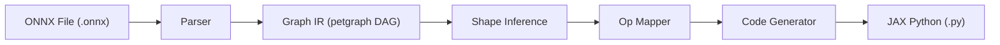
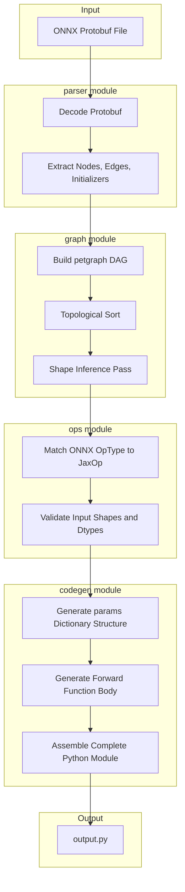
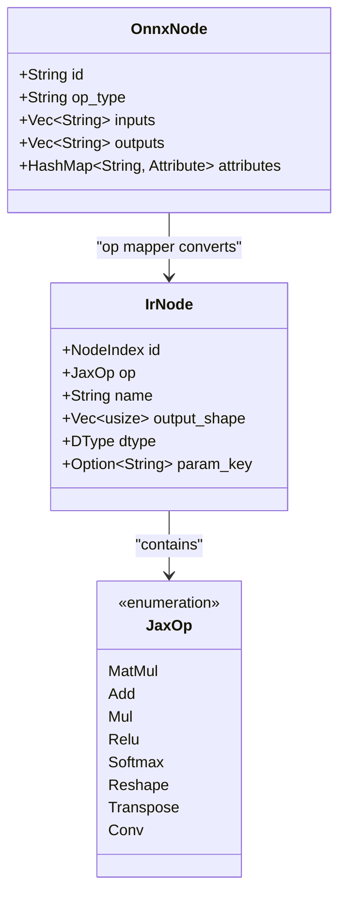
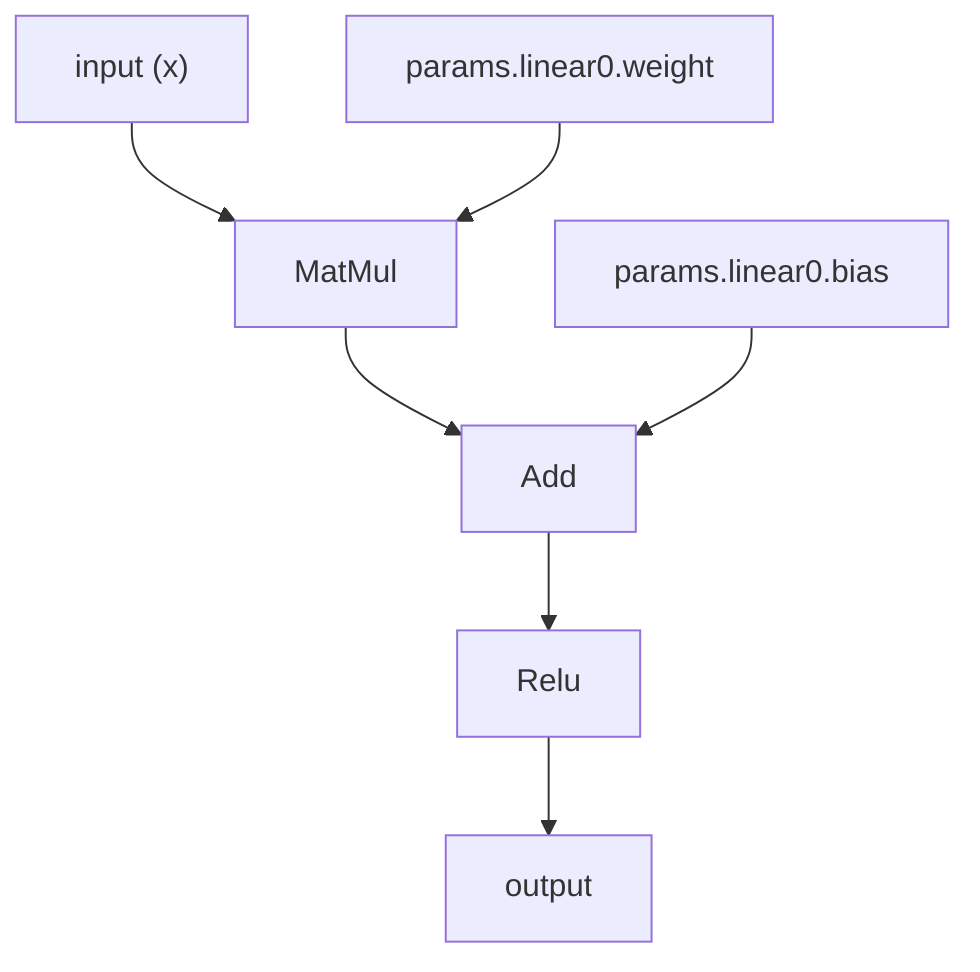
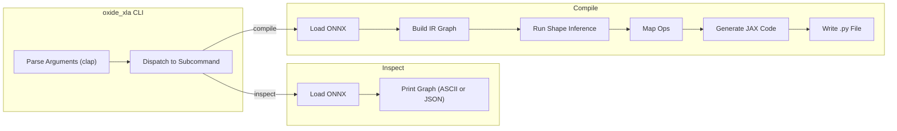
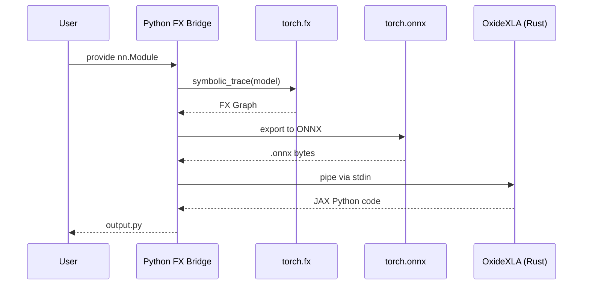

# OxideXLA Architecture

This document describes the internal architecture of OxideXLA using diagrams
and prose. Each section covers one stage of the compiler pipeline.

---

## High-Level Pipeline

The compiler follows a standard frontend-middleend-backend structure.

---

## Detailed Data Flow

This diagram shows every data transformation from input to output,
including the intermediate representations.

---

## IR Node Structure

Each node in the computation graph carries these fields:

---

## Topological Sort and Execution Order

The graph must be walked in dependency order. A node can only execute
after all its inputs have been computed.

The topological sort produces the execution order:
`[input, weight, bias, matmul, add, relu, output]`

---

## CLI Command Flow

---

## Stage 3: PyTorch FX Bridge (Future)

