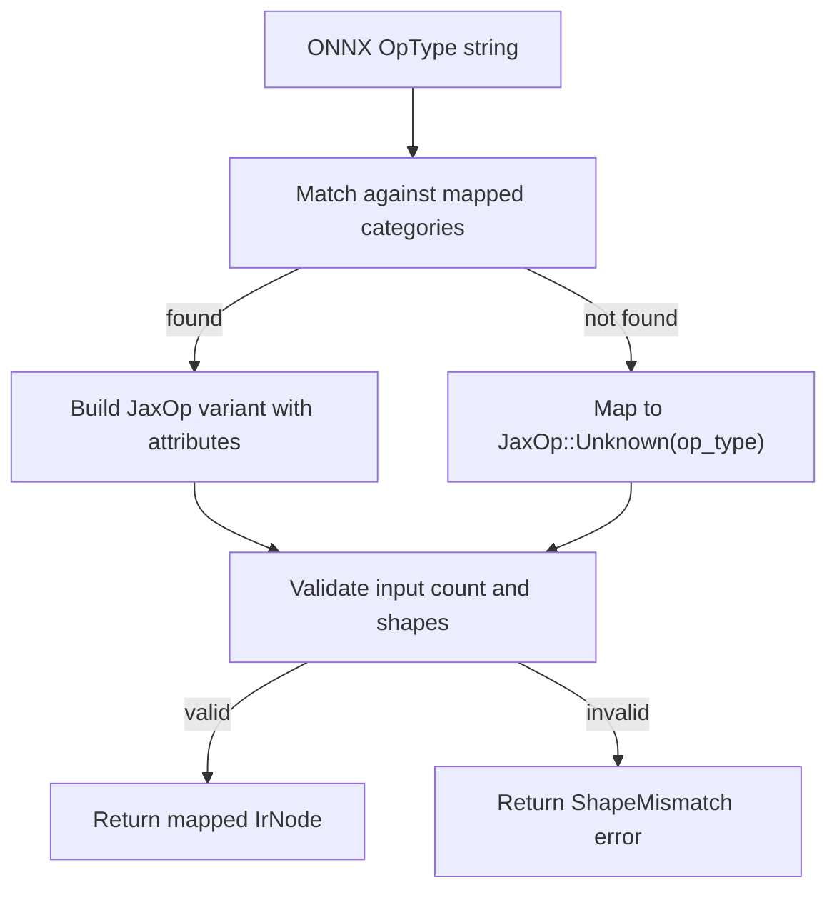

# Operator Mapping Reference

This document defines how each supported ONNX operator maps to its JAX equivalent.
These mappings are implemented in `src/ops/`.

---

## Mapping Table

| ONNX Op      | ONNX Inputs               | JAX Call                                | Notes                            |
|--------------|----------------------------|-----------------------------------------|----------------------------------|
| MatMul       | A, B                      | `jnp.matmul(A, B)`                     | Direct mapping                   |
| Add          | A, B                      | `jnp.add(A, B)`                        | Supports broadcasting            |
| Mul          | A, B                      | `jnp.multiply(A, B)`                   | Supports broadcasting            |
| Sub          | A, B                      | `jnp.subtract(A, B)`                   | Supports broadcasting            |
| Relu         | X                          | `jax.nn.relu(X)`                       | Elementwise                      |
| Sigmoid      | X                          | `jax.nn.sigmoid(X)`                    | Elementwise                      |
| Tanh         | X                          | `jnp.tanh(X)`                          | Elementwise                      |
| Softmax      | X, axis                   | `jax.nn.softmax(X, axis=axis)`         | Axis from ONNX attribute         |
| Reshape      | X, shape                  | `jnp.reshape(X, target_shape)`         | Shape from attributes             |
| Transpose    | X, perm                   | `jnp.transpose(X, perm)`              | Perm from ONNX attribute         |
| Conv         | X, W, B, strides, pads    | `jax.lax.conv_general_dilated(...)`    | Requires dimension_numbers       |
| BatchNorm    | X, scale, bias, mean, var | Manual: `(X - mean) / sqrt(var + eps) * scale + bias` | Decomposed, no framework call |
| ReduceMean   | X, axes, keepdims         | `jnp.mean(X, axis=axes, keepdims=...)` | Supports multiple axes           |
| Abs, Cos, Sin| X                          | `jnp.abs(X)`, `jnp.cos(X)`, etc.      | Extensive math support           |
| And, Or, Not | A, B                      | `jnp.logical_and(A, B)`, etc.          | Logical operations               |
| Cast         | X, to                     | `X.astype(dtype)`                      | Precision conversions            |
| Gelu, Mish   | X                          | `jax.nn.gelu(X)`, `jax.nn.mish(X)`     | Advanced activations             |
| Gemm         | A, B, C                   | `alpha * A @ B + beta * C`             | General Matrix Multiplication    |
| **Unknown**  | X                         | `X # Implementation Pending`            | Fallback for unmapped operators  |

---

## Mapping Strategy

---

## Supported Operators (High-level)

*   **Arithmetic**: `Abs`, `Acos`, `Acosh`, `Add`, `Asin`, `Asinh`, `Atan`, `Atanh`, `Ceil`, `Cos`, `Cosh`, `Div`, `Exp`, `Floor`, `Log`, `Mul`, `Neg`, `Reciprocal`, `Round`, `Sin`, `Sinh`, `Sub`, `Tan`, `Tanh`, `Erf`, `Sign`, `Sqrt`, `Pow`.
*   **Logical**: `And`, `Equal`, `Greater`, `GreaterOrEqual`, `Less`, `LessOrEqual`, `Not`, `Or`, `Xor`, `Where`.
*   **Activations**: `Relu`, `Sigmoid`, `Tanh`, `Elu`, `HardSigmoid`, `HardSwish`, `LeakyRelu`, `Selu`, `Softplus`, `Softsign`, `ThresholdedRelu`, `Gelu`, `Mish`, `PRelu`.
*   **Normalization**: `BatchNormalization`, `LayerNormalization`.
*   **Vision/Conv**: `Conv`, `MaxPool`, `AveragePool`, `GlobalAveragePool`, `Resize`, `DepthToSpace`, `Pad`.
*   **Linear Algebra**: `MatMul`, `Gemm`.
*   **Shape/Tensor**: `Concat`, `Gather`, `Reshape`, `Transpose`, `Tile`, `Expand`, `Shape`, `Identity`, `Slice`, `Squeeze`, `Unsqueeze`, `Cast`.

---

## Shape Inference Rules

Each operator defines how output shapes relate to input shapes:

| Op         | Output Shape Rule                                    |
|------------|------------------------------------------------------|
| MatMul     | `[..., M, K] x [..., K, N] -> [..., M, N]`          |
| Add/Mul    | `broadcast(shape_a, shape_b)`                        |
| Elementwise| Same as input (usually input 0)                      |
| Reductions | Axes removed or kept with size 1                     |
| Reshape    | Given explicitly by attributes                       |
| Transpose  | Permutation of input dimensions                      |
| Conv       | Calculated based on kernel, stride, padding          |
| Unknown    | Fallback to first input shape                        |
